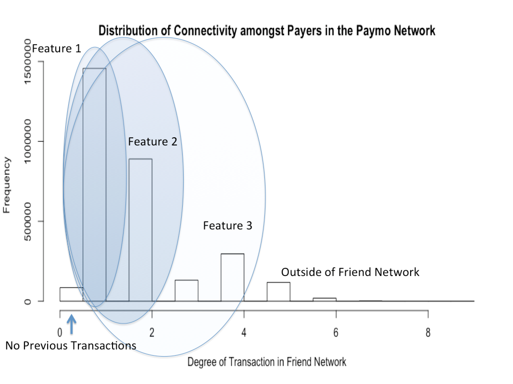
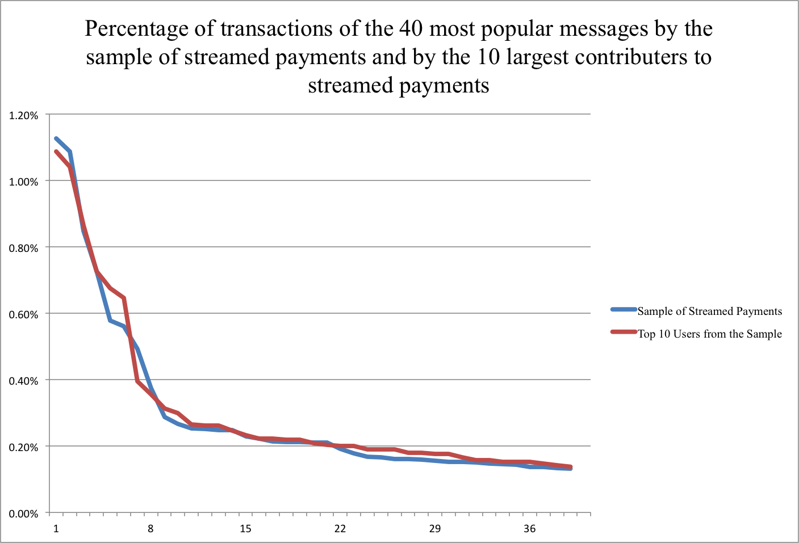
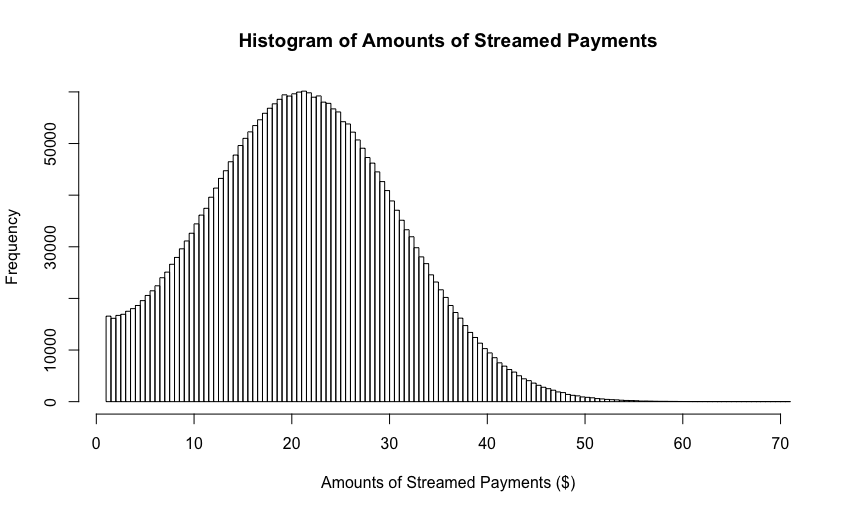
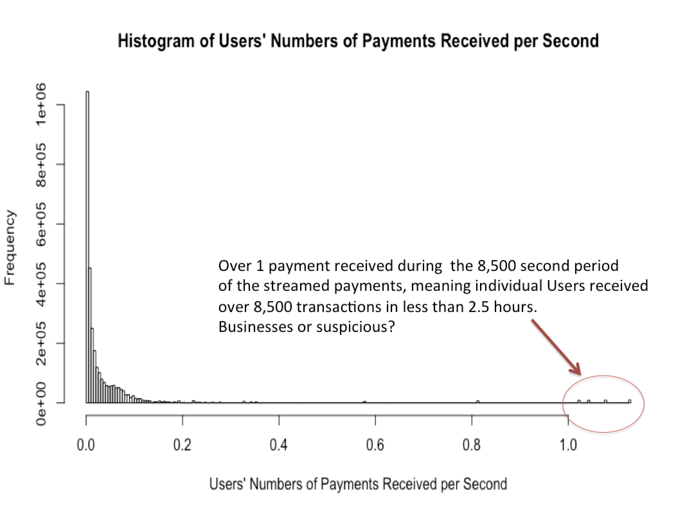
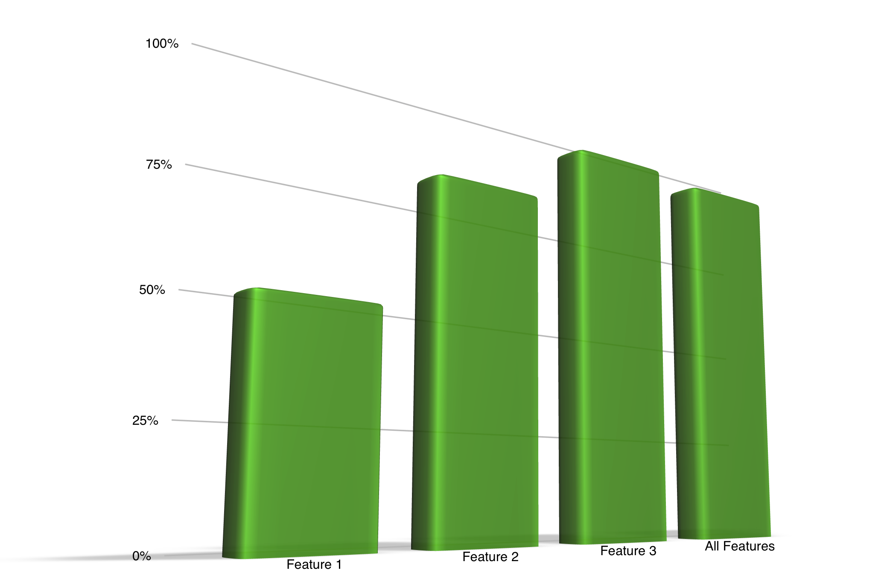
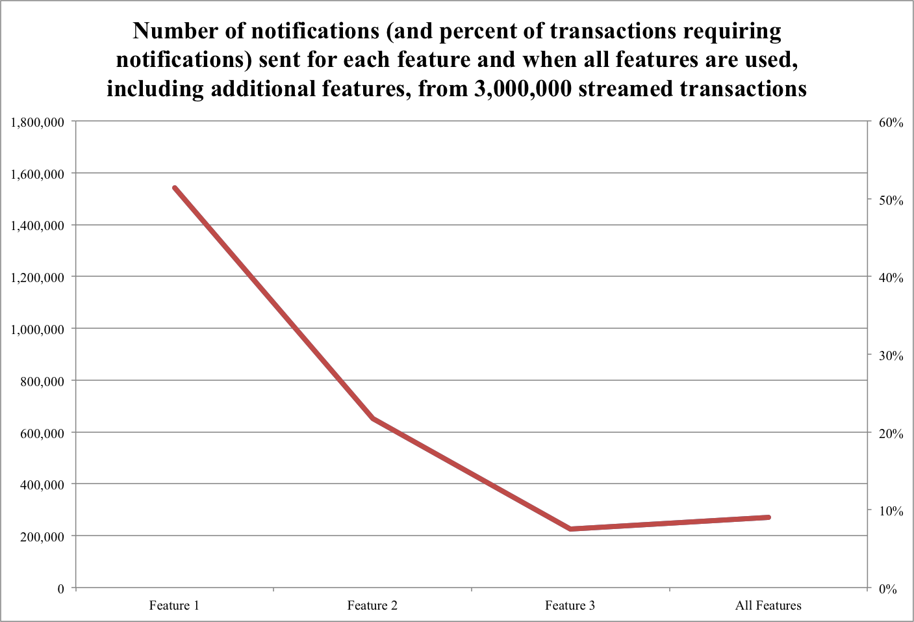

# Introduction
Thousands of digital wallet transactions occur every second for Paymo, and these methods have become an easy and quick way to distribute funds. Because it is so accessible it has also become a focus for criminal minded users to steal money via fraudulent transactions/requests for payments. For this challenge, I have built an algorithm that helps indicate possible fraudulent interactions and will allow Paymo to notify payers if their transaction is suspect. 

Overall, the algorithm is built in python, and majority of the runtime deals with building and understanding the historical transaction information. Within Paymo, and with more time, more effort should be focused on analyzing this information, and possibly building models to establish parameters that could be useful to the algorithm that handles streaming payments. 

The algorithm contains five features that verifies transactions that are sent through as a group of payments. The first three features pertain to the connectivity of people making transactions. In order to understand the connectivity of the users and history of transactions, we will break down a network and the method of the algorithm. 

Networks, and social networks, are graphs of connections, or edges, between people, or nodes, where paths and properties about paths exist and can tell us about the inter-connectivity and other characteristics of the graph and people in it. In this case, the history of transactions, represented by the batch of payments indicates a system of payers and receivers as nodes, and edges as the transactions between them. If we list these edges with equal weights (let us set this equal to one), then everywhere there is a shortest path with the length of one, there is a direct connection between nodes, or users. In other words, if the two users have previously made a transaction, then they will be direct connections, or have the minimum length of the network. By using a package that builds a network and a function that follows through a breadth-first-search algorithm like Dijkstra's algorithm, we captured the shortest distance from one user to another in a non-directional graph. (Dijkstra's algorithm goes through each node only adding the lowest cost path until it completes the route from the source, origin or payer, to sink, destination or receiver.)

#Features 1 through 3

This algorithm is not the most efficient way to find out if two nodes are connected; however, if we are to implement the following two features, we should not take short cuts early. The first feature finds only where the shortest path between two nodes is one, and the second feature finds only where the shortest path between two nodes is one or two. Likewise, the third feature follows through with the same logic; where the length of the shortest path between two users is four or less (but at least one), the transaction will be verified. When the shortest path is two, that means there is a user that connects two edges to the two users. Likewise, when the paths are three and four, there are two and three users along the path of previous transactions between the two users of focus. This establishes the first three features and creates the three original output files as requested. The following depicts the distribution from the main streamed payments file requested for input.

#Messages (No Feature for now)

The messages come from real Venmo transactions. These can be incredibly interesting and a lot of fun to read. My first assumption was that using these to detect fraud alone would not be helpful, because if I were acting fraudulently, I would try not to let my messages indicate this. While I cannot assume the intelligence of the fraudsters in the network, I do not believe that specific words or phrases alone can help detect fraud. Also, when discussing fraud here, I am referring to hacking methods of forcing payments from unaware users, and not money laundering, although the logic for both is consistent in many instances.

First, I believe that there are too many possible messages that could mean even more things. For example, with the plethora of emojis available and meanings behind those emojis, one should not be penalized by sending an emoji. 

Second, studying the distribution of the messages, the four most popular messages are "Food", "Uber", the pizza emoji, and the beer emoji. Using personal biases, I feel that these messages would be the most likely that I would use to distribute money via a digital wallet.

The third and final reason for not using the messages to determine fraud is that after a quick analysis of over a million payments, the distributions did not change for the most frequent payment recipients. In other words, after looking at the ten most frequent payment receivers (assuming, again, that id1 was sending money to id2), the distribution used carried the same distribution of messages used. This is seen in the graph below, the blue line is the distribution of the 40 most popular messages, and the red line is the distribution of the 40 most popular messages by the top ten most frequent users. This tells me that these elements of the data were fabricated, or that the fraudulent users hid their messages very well. In either case, I do not believe that messages could be used alone to detect fraud. The distribution of users with how it pertains to fraud will be mentioned later, but the user does not have control over their user identification, so it is different. Again, here, we will assume that even though the payer typically controls the message, in fraudulent transactions (where the payer is not in control), the receiver would probably insert this for the payer as a request for the money.

It is also worth noting that the distribution of the real messages was duplicated, such that it keeps the same distribution but does not help one depict fraud. For example, it seems improbable that six different users established transactions with an independent set of six additional users all for the mission of feeding Tom after his Austin trip by saying, "Groceries - hangry tom will have food to eat when he comes home from his Austin trip :)". I enjoy the addition of messages, and it complicates, slightly, the cleaning of the data, but for our purposes, extracting or interpreting fraud via message alone is not the best method.

#Amounts (Feature 4)

The initial analysis of amounts in order to determine fraud produced a few reasons as to why looking in this direction might not be the most telling strategy, at least with the data presented. First, the distribution of amounts is a nearly perfect normal distribution. The mean and median are extremely close, the tail is not as long as one might expect, and a Shapiro-Wilk test of normality even expresses the amounts as a normal distribution. I would have expected these values to be skewed to the left slightly as well, and follow Benford's law of the probabilities of leading values more closely. I have included a visualization of the distribution below. The biggest hint that these numbers in general were made up is that the distributions of amount values ending in whole dollars is about 1\%, which would only be the case if all cent values from .01 to .99 were represented evenly. I would bet that most customers would pay in whole dollar amounts. 

However, the amounts in themselves can help distinguish fraudulent users. We would expect fraudulent transactions to contain larger values, or a lot of smaller transactions (which we will discuss later). By using simple z-scores, we can pull out the top 2\% of transactions assuming that the cost to a user is minimal to ensure they meant to make such a large transaction. 

Even if Paymo's transactions do not follow this normal distribution, using a simple z-score to establish a fraudulent price cap will be helpful for all users. In the algorithm, the first additional feature calculates the standard deviation and mean from a sample of the batch payments. This number can be continuously refined to enhance the price cap. This value is then compared to all streaming payments. If the streamed, or new, payment is greater than that price cap, then the transaction will be flagged as untrusted. The price cap creation can be adjusted by Paymo, but for the code here, it will be represented as two standard deviations added to the mean. In a normal distribution, this cuts out only about 2\% of the transactions. The main design of this additional feature is the hope that any outlier (on the high side) will be flagged immediately, because while it could be fraud, it could also be a devastating typo or added zero.

#User/Id's (Feature 5)

If I were to force payments to my account, in a fraudulent manner, or attempt to launder money using this digital wallet, I would like to be able to extract or transfer large amounts of money. However, in order to avoid obvious suspicions, I would probably make a lot of smaller transactions. If the algorithm presents a feature for picking out outlying amounts, it should also pick out outlying users. 

In an initial overview of the receivers of payments (or id2), we observed users that would receive over 3,000 payments in less than one hour. A specific distribution of the streamed payments below shows that some users even received over 8,500 payments in a time frame of less than 2.5 hours. Again, reflecting my own biases, I cannot imagine having more than 1 transaction during that time frame. However, there is the possibility of businesses using the digital wallet to collect payments. In these cases, the identification number will be known and can be excused as the model evolves.

For the algorithm, we built in this feature by counting the number of payments that each user receives in a specific stream and divides by the number of seconds in that stream. We established a cap of 1 transaction per second. When testing 3 second, 10 second, and 30 second streams, we see a percentage cut off of 1-3\% of the transactions. When these identification numbers are approved as businesses, then this number will drop quickly as a low number of users are responsible for a large number of these transactions. 

Now, it might be advantageous, as a fraudulent user, to set up multiple accounts; but assuming Paymo has address, bank, and other personal information, this type of fraud can be detected on these levels, and will be ignored for this challenge.

#Conclusion

The additional features introducing caps for numbers of transactions per second per user and amounts for each transaction only reduce the verified cluster by about two percent each, which can be shifted dependent on the desires of Paymo. With adjustments, Paymo can shift the notification rate to their desired output, or even to the desired output of the standard every day or business customer. In the graph that follows, the first three bars will be fixed based on historical data, but with model fluctuations, the fourth bar can move up or down based on how strict the inputs are.

Currently, the algorithms have these features built in, and even produces the price cap itself. And these five features all together should give Paymo confidence in detecting fraudulent transactions. As we see below, for each of the first three features that are added, the number of notifications sent decreases. When the two additional features are included, more "fraud" is detected, but the increase in notifications sent is not dramatic. This can be seen below.

It is worth repeating that the features are efficient if they come in by batches with the network already loaded. Assuming the network continues to build, caps can be placed on the time exhausted by Dijkstra's algorithm, if we are not concerned about the difference between users who are not connected closely and users who are not connected at all. Further models can be built on message, identification, time, and amounts to further refine the understanding of what is fraudulent. These can be cooked into the algorithm so that the process can be made more efficient. Unfortunately, these statistical methods take resources to build in, refine, and implement.

Together, the code takes the most time to build the network on historical transactions, and then run through the network, but the time to actually score each transaction is minuscule if the system can be pre-built and loaded. 

#Coding Comments

Learning Python and building the code, I wanted to stick to my roots of analytics. For this reason, I decided to add the extra steps to print and save clean tables. Along with this philosophy, I come from a database driven background, so rather than looping through the table twice to establish counts for each, I used a left join, or merge. In order to do these things, I imported the pandas package. 

In order to run array operations I imported numpy. I used arrays to build a network. Coming from an optimization background, I feel that the most efficient way to comprehend the degree-of-friends reached to make a payment is the utilization of uniform weights across a node network. I imported networkx and established users as nodes and their transactions as edges. To understand the degree-of-friends, I measured the length of the shortest path from payer to receiver (undirected for this code). I used the simple shortest_path, since all of the lengths are uniform, the quick breadth-first search would be sufficient (similar to Dijkstra's algorithm with this parameter, but faster knowing that). Rather than run through each feature individually (the first would have been much quicker without a network, especially if I were using a database method join or merge), I calculated them all the same for the sake of exporting to statistical model building and understanding. This also could be done with a cutoff after the 4th degree friend, because there is technically no difference to 5th degree, 8th degree, and 0th degree friends with respect to verification. However, for Paymo's benefit, I ran through completely at once, without cutoffs.

I also imported csv, time, and shutil for import and output capabilities.

Included in the src folder are 4 files. First, there's the antifraud.py file which (on my machine at least) passes the tests that I ran using run_tests.sh and run.sh. This is a cleaned version of allfeaturesUIOutput.py, which ask the user for input and can provide a printed output, as well as times each step of the process.

The last two files are batchbasesetup.py and streampaymentrun.py. These files breakdown what I feel would be the most logical sense. There is time spent building the clean history file and writing it to a csv as well as time to build the network and even the simple price model. These can be done in the base, separate from any streamed payments.

Once this has been completed, the streampaymentrun.py file can be run whenever stream_payment files come in, an epitomized mock of real-time streaming API. This file works only off of the stream_payment.csv file but requires the loading of the network and price. All files are essentially the same, showing all 5 features.

Other notes: batch_payment.txt and stream_payment.txt were too large for the additional test folder that I created, so it has been left out. newpayment1 and paymentlist1.csv files are created for the purpose of additional statistical study. output4.csv is created as the combination and output.txt is the full database with features and degree calculation. This table was useful in building tables and understanding. Since the additional scripts were built earlier and not thoroughly cleaned, adjustment to the directories or file names might be necessary (at most), antifraud.py is good to go.

In conclusion, thank you very much for the opportunity to participate in this interesting problem, and if there are any questions unanswered, please feel free to reach out to me with questions!
